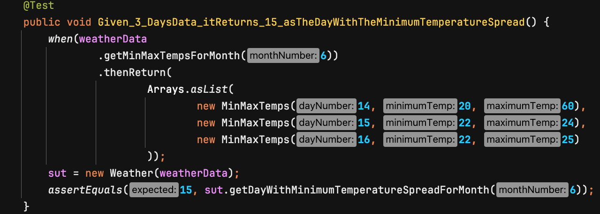
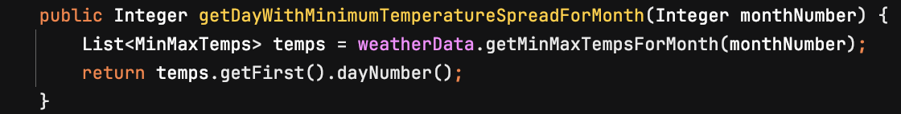
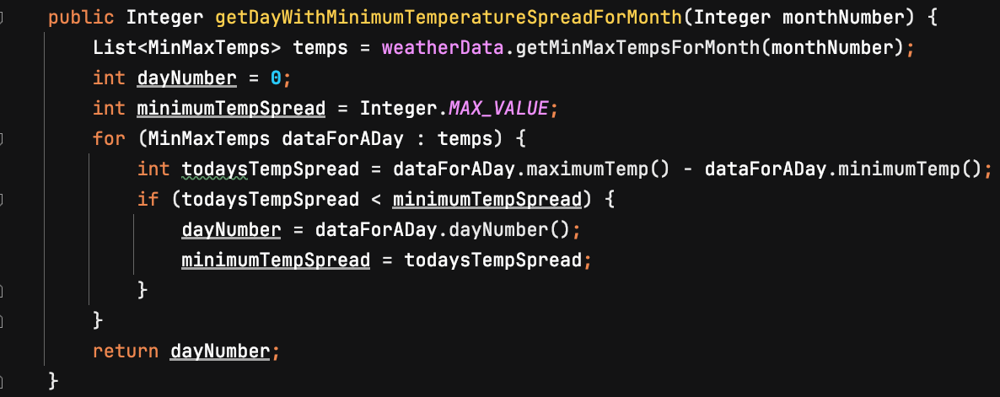
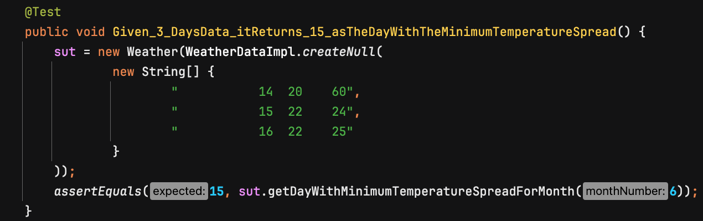
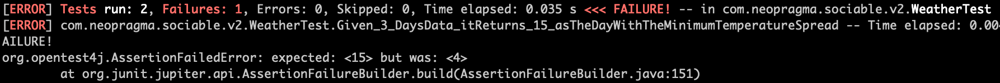
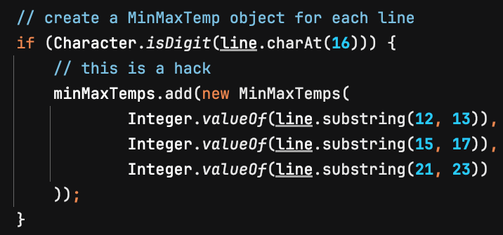
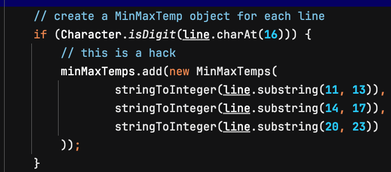
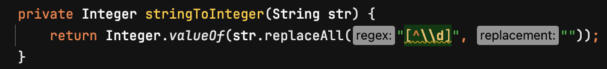

# Learning About Sociable Tests

Sociable Tests are a kind of executable test used in software development and testing. They were devised by [James Shore](https://www.jamesshore.com), author of [_The Art of Agile Development_](https://jamesshore.com/v2/books/aoad2) (highly recommended, by the way) and a leading proponent of robust software engineering practices. 

Through his long experience applying test-driven development (TDD) and related practices, and teaching/coaching such practices in a wide range of companies over the years, James noticed certain recurring problems with executable test suites and application design that he felt may arise from conventional approaches to TDD. Even if the problems don't arise from those practices _per se_, they are at least commonly seen in codebases that were built using TDD. 

He wanted to find a way to enjoy the benefits of TDD that didn't tend to create or exacerbate those problems. Sociable Tests are part of his solution, which he calls a "pattern language" for testing. His approach is documented in the article, ["Testing Without Mocks: A Pattern Language"](https://www.jamesshore.com/v2/projects/nullables/testing-without-mocks). There is more to the approach than just Sociable Tests, but that is the focus of this exploration. 

## Schools of TDD

TDD has a long history in the software industry, and you're probably familiar with it. I'd like to offer a little context just to set the stage for the exploration. 

There are several ways to approach TDD that have yielded good results, and many more ways in which TDD has been misunderstood and misapplied, with...well, _unsurprising_ results. It's easy to see how TDD may be misunderstood because some of the key terms used to describe it are not really precise - notably the words "test," "driven," "development," and "unit."

In a nutshell, there are a couple of popular ways to approach TDD. They are sometimes called the Detroit School (or Chicago School) and the London School of TDD. For reasons that remain unclear to me, many people seem to think the two are very different, and/or we must choose either one or the other when we use TDD. 

Practitioners actually mix and match the two freely. The choice depends on what we're doing at the moment. We don't even pause and think, "Gee, I guess I should switch to the other school now." We just do what makes sense in context. So, it's a little puzzling that people make such a fuss over it.

Dave Farley, the person behind the [Continuous Delivery channel](https://www.youtube.com/@ContinuousDelivery) on YouTube (highly recommended, by the way), was an early adopter of both "schools" of TDD and knows most of the people who were involved in their creation. At time offset 13:36 in his video, [Are You Chicago or London When It Comes to TDD?](https://www.youtube.com/watch?v=_S5iUf0ANyQ), he explains, "The London School is really an extra layer of ideas on top of the Chicago School that allows us to proceed when we have fewer answers."

The point of mentioning this here is to clarify that there's no need to plow through all the exercises using Detroit and London TDD separately. That would not tell us anything useful. The key difference to explore is the use of mocks vs. the use of Nullables with Socialized Tests, which don't use mocks. 

Most material you see on the subject will talk about _classes_, _objects_, and _methods_. That's because TDD and its friends were invented in a time when Object-Oriented languages were very popular and commonly used for application development. Yet, TDD is not limited just to Object-Oriented languages. 

## What are mocks?

In order to isolate the code under test from external dependencies for the duration of one specific test case, we use a construct known as a Test Double. A Test Double stands in for a real dependency of the code under test in much the same way as a [stunt double](https://stuntteam.org/what-is-a-stunt-double-everything-you-need-to-know/) stands in for an actor in a movie. I don't know who coined the term or when, but it became popularized after the publication of Gerard Meszaros' 2007 book, _xUnit Test Patterns: Refactoring Test Code_. 

Meszaros is also credited with creating a taxomony of Test Doubles. As far as I know he didn't make them up, but he sought to regularize the terminology around them. People were using various terms that seemed intuitive to them, but the hodge-podge of inconsistent terms were confusing for people interested in getting started with TDD and refactoring. Meszaros settled on _stub_, _mock_, _spy_, _fake_, and _dummy_. 

J.B. Rainsberger's 2001 book, _JUnit Recipes: Practical Methods for Programmer Testing_, contains these plus quite a few more, but most of the terms have fallen out of use. I think some or most of the terms were already in use before then.

Regardless of who should get credit for what, the basic idea of a _mock_ is a software construct that looks and acts like a real external dependency, but isn't real. It can return a predefined response to a call to any method/function of the real dependency, and it can keep track of the interactions between the client code (usually a test case) and itself. It reduces the cost of test setup and execution and ensures the behavior of the dependency will be consistent across executions of the test case, so the test case provides consistent and reliable results. 

## Do mocks lead to bad design?

It's common to hear/read that using mocks with TDD leads to bad software design. Rather, it seems to be the case that bad design leads to ever-more-complicated mock setups in executable test cases. At some point, things become so cumbersome that the ship falls over and sinks, like the [Vasa](https://www.vasamuseet.se/en).

Now, no one likes to think they had anything to do with sinking the ship. So, people often blame their tools - in this case, the use of mocks or the use of TDD itself. But I'm pretty sure if you don't apply fundamental software design principles to your work, you can cause the same problems using Nullables and Sociable Tests as you can using mocks. 

If the bad design is causing problems with mocks rather than the other way around, then substituting Nullables and Sociable Tests for mocks won't solve it. Let's find out.

## About this exploration 

What I have in mind is to try test-driving a small application using conventional TDD on the one hand, and again using Nullables and Sociable Tests on the other. 

The pattern language is explicitly focused on Object-Oriented languages, so let's start with those. I propose we try languages with static typing and dynamic typing, and languages that separate test code from production code in different ways. That way, if any of those characteristics has an effect on James' approach, we'll see it. 

With that in mind, I suggest we try Java, C#, and Ruby. Java and C# use static typing and developers conventionally use different techniques to separate test and production code. Ruby uses dynamic typing. 

## What toys shall we play with?

I'm thinking of using Pragmatic Dave Thomas' Kata #4, _Data Munging_, from the [Code Kata](http://codekata.com/kata/kata04-data-munging/) site. It's simple, yet involves more than one component and includes refactoring, as well. Those characteristics should help us quickly get a sense of the Nullables with Sociable Tests approach.

The kata comprises three parts. We are asked not to read ahead, but due to the nature of this exercise it's hard to avoid doing so. We'll pretend we don't know what's coming, as best we can. 

Part 1 involves reading some data about weather in Morristown, New Jersey, for the month of June, 2002. We want to find the day in which the difference between the minimum and maximum temperatures was the smallest during the month. 

Here's a screenshot of the top few records in the input file. 


This looks like fixed-format data in which each field starts at a particular offset from the beginning of each record and is a specific number of bytes in length. Numerical values have leading zeroes removed. 

This format would be hard to ingest in some languages and easy in others. However, I/O handling is not the point of the exercise. Besides that, I/O is a separate concern from the "business logic" of the application. 

Looking at this in terms of London School TDD, the interface between the application and the I/O functionality is at the "edge" of our code. Therefore, we want to write an adapter layer for it. 

So, we already have a candidate for a mock and, conversely, for a Nullable. Good! We're using an OO language, so we'll mock the adapter interface or make the adapter class Nullable. 

## Cheating 

Approaching this with Detroit School TDD, I would not make assumptions about what classes to create. Instead, I would start writing microtests to tease out information about what the design "wants" to be, and when the test suite answers that question I would extract the production code into the appropriate classes and clean up the remaining test code.

But that's not the point of the exercise. We want to get down to the mocks vs. Nullables exploration right away. So, I'll assume we'll want a Weather class that responds to client requests for the day that had the smallest temperature spread, and an adapter class to read the data from an external source. Those will be our two components, with one depending on the other. 

## Separation of concerns

The client request may arrive from any sort of user interface or API. The code in the Weather class needn't know anything about that. 

## Java

The first language to explore is Java, an OO language with static typing. 

### Java version using mocks, step 1

By convention, nearly all Java developers separate production and test code by creating separate directory trees for the two, and defining the same package in both trees. Tools like Maven, Gradle, IntelliJ IDEA, and Eclipse IDE assume this is the default directory structure for all Java projects. 

So, making the same assumptions and skipping ahead a bit in the TDD process, the code in subdirectory ```sociabletestsjava``` in package ```com.neopragma.withmocks.v1``` is what I came up with as a starting point for developing Part 1 of the Kata.

Where we are: 

- We have a single failing unit test case that fails for "the right reason". 

- We have a mock of interface ```WeatherData```, which ostensibly will become the basis for a class to read the input file and get the data into a Java-esque form. At the moment, we don't need a concrete implementation class for ```WeatherData```. 

- The Java-esque form of the weather data is represented by a value object, implemented as a Java Record named ```MinMaxTemp```. 


### Java version using Nullables, step 1

Now let's bring the Nullables with Sociable Tests version up to an equivalent point. 

Per the pattern language, a Nullable is a class that can be instantiated with a minimal configuration, just suffient to provide a "valid" instance that supports all necessary "business" logic but excludes real functionality to read/write external data stores and so forth. James suggests defining a factory method named createNull() to handle the instantiation. 

His article also provides examples of how to include an Embedded Stub to mimic selected functionality of an external dependency, and how to define parameters for the Nullable's createNull method to pass in values we want to be returned in our test cases. 

Bear in mind I'm not an expert at this; I'm trying it for the first time. Hence, the code in subdirectory ```sociabletestsjava```, package ```com.neopragma.sociabletests``` may be more complicated than necessary. 

Where we are:

- We have a single failing unit test case that fails for "the right reason", not using mocks.  

- We have a Nullable concrete implementation of interface ```WeatherData```, named ```WeatherDataImpl```. It has factory methods ```create()``` and ```createNull()``` based on the explanation and examples from James' article.  

- The Java-esque form of the weather data is represented by a value object, implemented as a Java Record named ```MinMaxTemp```. This is the same as for the version using mocks. 

### Impressions so far 

At this point, I had not built enough functionality to experience the potential value of Nullables and Sociable Tests over mocks and isolated tests, but I already had an impression of the two approaches from the perspective of how hard or easy they are to use.

Just getting to this bare-bones starting point was a bit of a hassle using mocks. In my view, it's always a hassle to use Java with Maven or Gradle plus IntelliJ IDEA or Eclipse with Mockito or any other mocking library added on. All those tools work fine individually; the hassle comes up when you try to use them together. 

Maybe I should say, when _I_ try to use them together. No matter how many times I've used these tools together, it never gets any easier. You're probably better at this than I, so that might sound funny to you. But I may be a pretty good example of an "average" programmer, and that's what you'll have on your team, so don't laugh too hard. 

I was looking forward to writing the same code without using mocks. I understand that the first time any of us tries something new, we encounter some speed bumps. That's only to be expected. There's a learning curve, after all. But even considering that, I found the process of getting the first failing test case to the right state to be far more tedious using Nullables than it was using mocks. 

The main reason was that I had to invest far more mental energy into the details of handling file I/O than I really wanted to invest at this early stage of development. I wanted to focus on the details of the Kata, not on "infrastructure" details. But I had no choice if I wanted to write a Nullable that included an Embeddable Stub that could behave exactly like a Java BufferedReader to ingest the input file provided for the Kata. 

Even then, the result is an awful hack that will require ongoing improvement throughout the development process. All that effort amounts to hand-rolling a mock. We discard the mocking _library_, but we end up rolling our own in the end. The Nullable ```WeatherDataImpl``` class is a kludge of production code mixed with pseudo-mock code. 

None of that belongs with the production code. Its presence increases the threat surface of the deployed application, without adding any value beyond what we get by using mocks and keeping all test-related code separate from the production code. At least, that's my impression so far...but I've only taken the first baby steps. Let's see how it goes from here. 

### Java version using mocks, step 2 

This isn't Part 2 of the Kata (it has three parts). It's just "step 2" in the pseudo-TDD development process I'm following. 

What I'd like to do in this step is implement enough functionality to identify the day that has the smallest temperature spread, given more than one day's weather data. 

First, I set up a test case with a mock that returns three values in succession, like this. 



As expected, it failed because the production code always returned the first entry in the list. So far, so good. 



A naive implementation makes the test case pass. 



### Java version using Nullables, step 2

Now let's do the same with our Nullables version. 



Here's the output from the test run:



The new test case fails as expected, but not for a "good" reason. Notice the actual result was Day 4, which isn't correct. The production code is plucking out the second digit of the day number from the input record, and the first day in this set of input data is 14. This is because of the hacky implementation of the Embeddable Stub. 

This is in the ```loadMinMaxTemps()``` method of class ```WeatherDataImpl```. 



If we change this hack to a slightly different hack, we can extract the strings corresponding to field values in each input record into integers, removing all characters that are not numerical digits. We can also handle day numbers of 1 or 2 digits and temperatures of up to 3 digits (but not negative numbers or decimal places).





Now the new test case fails for the "right reason" - the production code always returns the first day number in the list. 

If we put the same naive solution into the ```Weather``` class as we did in the mock version, the test cases all pass. Now both versions are at the same point.

However, we spent considerably more time taking this small step with the Nullables version than we did with the version using mocks. We had to context-switch between thinking about the business logic of the application and thinking about how to make our Embeddable Stub behave like a mocked-out BufferedReader. 

Since we had to make our Embeddable Stub work the same as a BufferedReader, will the program "work" with the entire input file? I wrote a driver class, cleverly named ```Driver```, to run the application from a command line. Lo and behold, after a little tweaking of the ```substring()``` values for the fields, the "full application" ran and yielded the correct answer. 

This result would have been deferred using the version with mocks, as I wouldn't have bothered to get the I/O functionality working this early in the development process.

But I still don't like having hand-rolled mock code included in the production code. 


