[To README.md](README.md)

# Iteration 2 Java Walkthrough 

In iteration 1 we "cheated" - skipped ahead in the TDD process to get to a point where the difference between mocks and Embedded Stubs would come up. The result was a bit of a mess that didn't really apply the test pattern language in a way that gave us useful information about how it compares with using Test Doubles. This time, we'll painstakingly test-drive the solution. 

We know the solution to the Weather portion of the Kata has to read text records that contain the day number and minimum and maximum temperatures in string form. Then it has to extract the day number and compute the temperature difference per day. Finally, it must return the day number of the day that had the smallest difference between the minimum and maximum temperatures. 

First test: Calculate the difference between two temperatures. The code under test (CUT) is inside the test class because we don't yet have enough examples in place to suggest how we might structure the solution. We expect the wrong answer so we can see that it is possible for the example to fail for the right reason.


Running the tests we get failure for the right reason. 


We correct the implementation:


Now the test passes. 


We know we'll have to pluck the day number and temperatures out of the input record. Let's drive out that functionality next. We set up an example to check that the code can extract the day number from a record. We write the implementation wrong in a deliberate way to ensure the example can fail for the right reason. In this case, we extract bytes 2 through 5 instead of bytes 2 through 4. We should end up with the day number plus an extra blank space.


And there it is - failure for the right reason. 

Let's fix the implementation and get to green.


We also need to extract the minimum and maximum temperature values from the input record. There's a twist - the input records look like lines from a report that has been formatted for human consumption. The values are spaced out along the line apparently for readability. Numerical values have leading zeroes replaced with spaces. That's fine for day number; it's for display, so showing it as a string with leading zeroes supporessed works well. But we have to convert the temperatures to a numerical format to perform arithmetic on them. As the temperatures are in Fahrenheit, they may be up to three digits long. So, the maximum temperature field in the input record starts in position 11 and is three bytes long. We'll have to handle the leading space somehow. First, let's drive out the logic to extract the field as-is. We'll write the implementation so that it will return the value with a trailing space, to make sure the example can fail for the right reason.


Okay, the example can fail for the right reason. Let's fix the implementation and get to green.


So far, so good. We can pluck out the correct characters from the input record. From examining the input data, we know the values are always integers. Therefore, the simplest way to convert the string representation of a number tha may be from 1 to 3 digits long is to use a Regular Expression to eliminate all characters that are not decimal digits. We changed the last example to expect an integer 84, and added the Regular Expression to the method implementation. Skipped taking a screen capture of the failed example this time. The final result is:


What if we have a negative temperature value? Our naive Regular Expression may discard the minus sign. Let's try it and see.


As expected, our implementation doesn't work for negative numbers. Let's adjust the Regular Expression. The change is pretty small. In case you didn't notice it, we added a dash inside the square brackets where we have the negated character class for digits.


The logic to pick up the minimum temperature for the day is the same, except we'll look at different positions in the input record.

At this point, we have snippets of code in a test class that verifiably extract the day number, minimum temperature, and maximum temperature from a single input record, and code to compute the difference between the maximum and minimum temperatures. We still haven't decided what Java classes to create. First, let's consider the next interesting bit of functionality we have to implement. 

The solution has to process a list of input records and find the day that had the smallest difference between minimum and maximum temperatures. That suggests we'll need a list of objects that contain the day number and the temperature difference for that day. Java doesn't natively support tuples. There's a library we could use for that, but we'd rather not add a dependency to the project just for that. We can use a Java Record instead.

Before getting into list processing, let's make sure the code we have will produce a Java Record with the contents we want. We cobble together the pieces based on some of the small examples we've coded. It doesn't have to be pretty at this point.


This is getting to be a bit much to jam into a test class. Let's think about domain entities and other such matters. 

This part of the Kata concerns weather, so let's encapsulate our logic in a class named ```Weather```. We are asked to find the day with the smallest temperature range in the input data, and return the day number. But users/clients are not going to create the input records themselves and pass them directly to the Weather application. They'll specify a file the Weather application must read. File I/O is a separate concern from the application logic. So we have two entities - the ```Weather``` class for the "business logic" and some other class to manage access to the file. 

## It's time to split the code into isolated tests and Sociable Tests

We don't want to have real files as dependencies in our unit test suite, so we need a way to supply the ```Weather``` class with a real or fake file. 

This is where we start to do things differently when we're using mocks and when we're using James' pattern language for testing. We'll supply our fake file to the ```Weather``` class in different ways.

Using a mocking library, the typical way to do this is _via_ dependency injection. We'll define a mock (actually, a stub) and configure it to return one fake input record at a time. Test cases will inject the mock into the ```Weather``` object. That way, the production code can read the file as usual, while test code will receive the fake records from the mock. It might look something like this (crudely):


Using the pattern language, the way to do this is to define an adapter for the external dependency. File accesses will go through the adapter. The adapter will contain an [Embedded Stub](https://www.jamesshore.com/v2/projects/nullables/testing-without-mocks#embedded-stub) that acts like the real object that reads the file. We're going to use a Java ```BufferedReader``` instance for that, so the Embedded Stub will have the method, ```readLine()```, which will behave just like the ```readLine()``` method of ```BufferedReader```. Then we'll use dependency injection to supply the adapter to the ```Weather``` class, configured to perform real file I/O or to return fake records from the ```readLine()``` method. It might look something like this (crudely):


The source files for this exploration are in subdirectory ```iteration2-sociabletestsjava```. The version using mocks lives in package ```com.neopragma.withmocks.v1``` and the version using Sociable Tests lives in package ```com.neopragma.sociable.v1```. 

## Version using mocks 

The goal was to use a mock to substitute test records when the ```Weather``` class read the input file. Ideally, substituting a fake return value when the code under test called method ```readLine()``` on a ```BufferedReader``` instance would have satisfied the need. But ```BufferedReader``` doesn't lend itself to mocking or stubbing. We have to wrap it in some other class and then mock the wrapper class. The wrapper class has no function in the application; it only exists to enable mocking or stubbing of the ```readLine()``` method. So, in a sense we have to hack the test code, even from the very beginning of writing the application. This is not a strong argument in favor of using mocks. 

I chose to use IntelliJ IDEA for this exploration because it's the most widely-used IDE for Java development. I expected difficulties working with IntelliJ IDEA and Mockito, as I have never seen this combination of tools work easily together. In this case, IntelliJ could not recognize the dependency ```org.mockito.junit.jupiter.MockitoExtension```. After an hour of fiddling with it, I deleted the line ```@ExtendWith(MockitoExtension.class)``` and started to type it slowly, allowing the IDE to catch up with my fingers. The IDE presented a list of possible completions and I selected the one I needed. That way, the IDE was able to recognize the dependency; but when I typed in the source line myself, the IDE was unable to make any connections between the code and the context of the project. Rather than a convenience, autocompletion was a requirement. This is something I dislike about this tool stack, and it's another negative vote for using mocks for this exploration.

When tools demand my attention and force me to fiddle with them instead of focusing on the work I'm trying to do, I don't like it.

Here's what I ended up with:

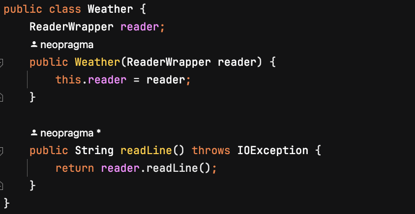

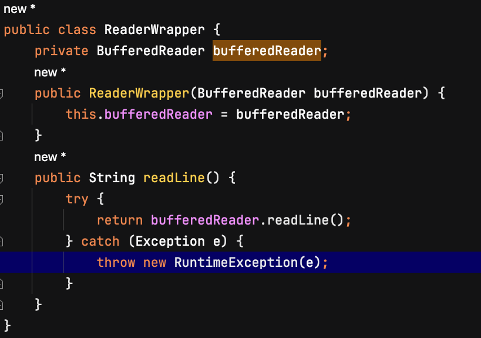

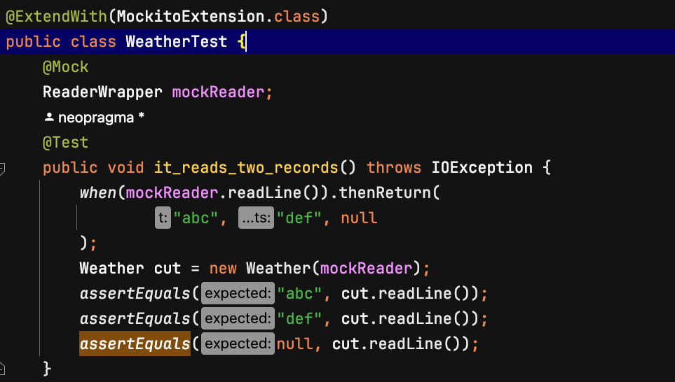


## Version using Nullables

Let's see how the above compares with using a Nullable with an Embedded Stub. 

On the plus side, I didn't have to deal with the flakiness of Mockito plus IntelliJ IDEA. 

However, there are many issues with my code. At first I followed the examples from James' article
carefully. This resulted in code that did nothing at all. To get it to yield the same results
as the version using mocks, this is the way the ```Weather``` class ended up:

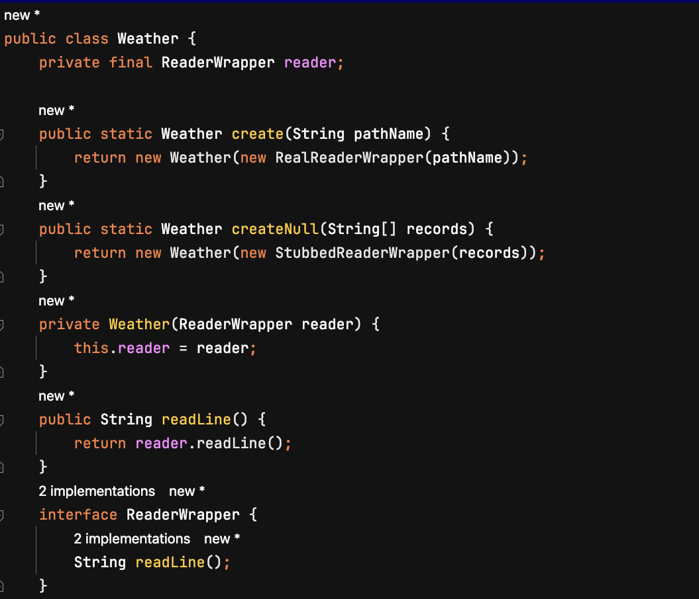
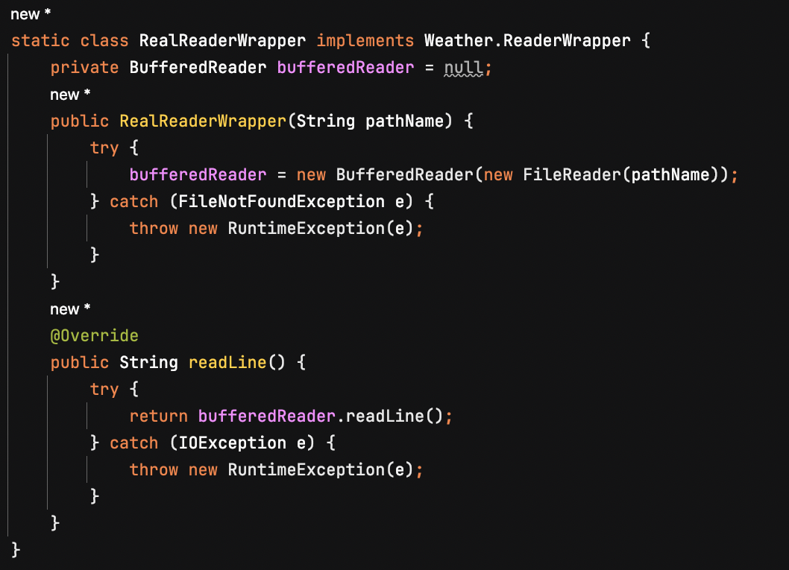
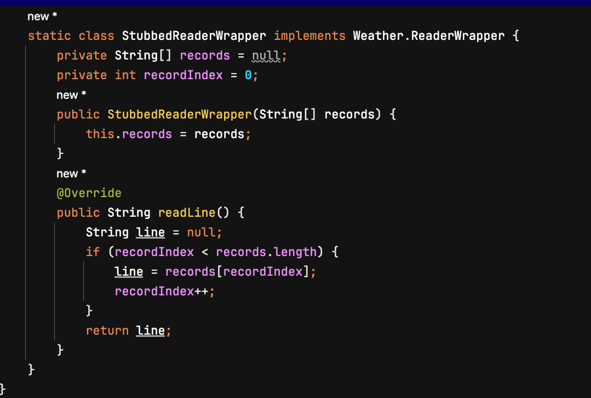

Apart from being much longer than the other version, this code deviates from the 
pattern language in several ways.

According to the model, the factory methods should take no arguments.
Based on feedback from James on my "iteration 1" exploration, we are also 
not supposed to use Builder-style methods or setter methods
to supply necessary values to the class, the thin wrapper, the real
implementation, or the stubbed implementation. Is this feasible in Java?

The BufferedReader instance member in RealReaderWrapper and the String[]
instance member in StubbedReaderWrapper are supposed to be declared final,
per the model. Yet there is no way to assign values to them when they
are declared final. All the constructors and factory methods are supposed
to take zero arguments. 

The Thin Wrapper interface and its two implementations are supposed to be private - 
in this case, visible only inside class ```Weather```. But the path name for the real
implementation and the list of fake records for the stubbed implementation must be
supplied from outside class ```Weather```. Otherwise, the whole setup is useless. 

Therefore, this code fails the test. It is not a valid implementation of
the Nullables and Embedded Stub approach because it doesn't follow all
the rules. If we followed all the rules, the code would do nothing. We can't really
compare the version using mocks with the version using Nullables in an apples-to-apples way,
because we can't stay true to the model using the Java language, except for the most trivial
examples, such as the Die Roller example. 

On the other hand, if we don't worry about academic purity we _can_ write Java code that is
at least _similar_ to the model, and avoid using a mocking library. Compare this test class
with the one for the corresponding version that uses mocks. 

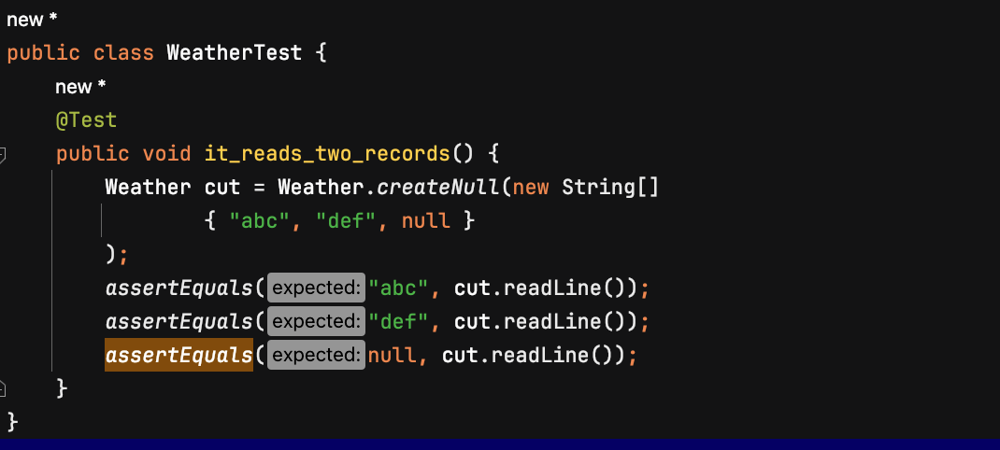

I wouldn't say this is necessarily _simpler_ than the other version, but it's not really any
more complicated. As far as developer effort is concerned, the test cases are a wash. The production
code is considerably more complicated than in the other version. 

## Parsing input records 

The input file provided with the Kata looks like this. 


It appears to be a "report" that has been formatted to be readable by humans. Fields begin in specific 
columns and have fixed lengths. Numerical values have had their leading zeroes stripped off and replaced
by spaces. So, we have to pluck out the values using substrings, as we did in some of the initial 
test cases. (We _could_ process the records as space-delimited fields; the tricky bits come after the fields
we care about, so that wouldn't be too troublesome. But I didn't.)

The file also contains "header" records. Those don't contain any weather data that our application
cares about. However, if we receive a file that isn't formatted per specifications, we should
probably treat that as an error condition. 

Let's see how we can support those requirements. 

We need to change this test case in ```WeatherTest``` so that it takes more-realistic input records. 
The idea is to "drive" us to improve the implementation of ```readLine()``` in class ```Weather```. 

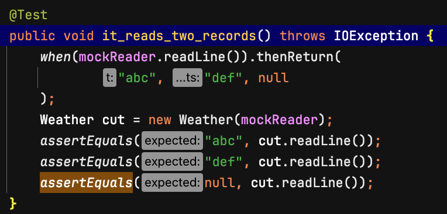 

Taking baby steps, here's a version of the test case that provides a couple of data records. 
We'll deal with header records in a minute. 

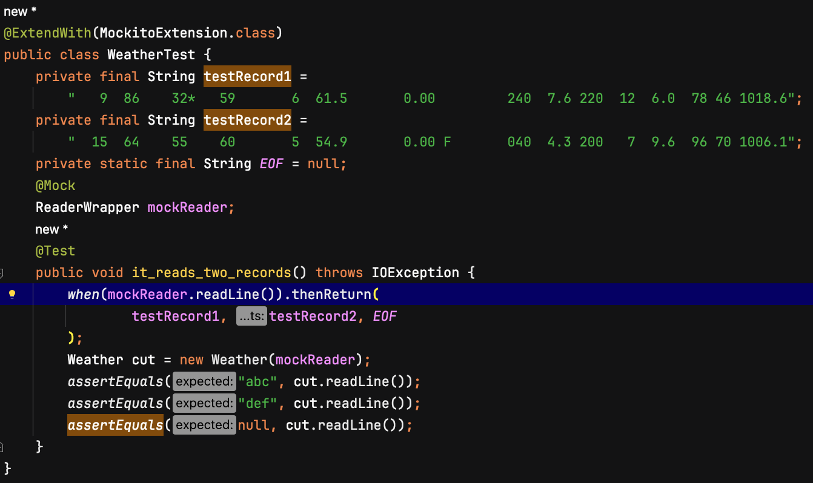 

Now let's check that the example fails for the right reason. Our prediction is that the returned string values 
will not match the expected values. 

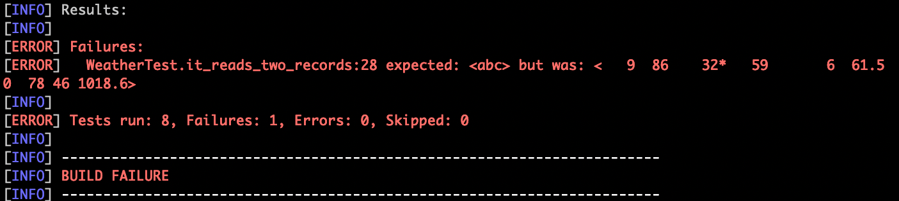 

Okay, that looks fine. Let's adjust the expectations and get to green before modifying the implementation. 

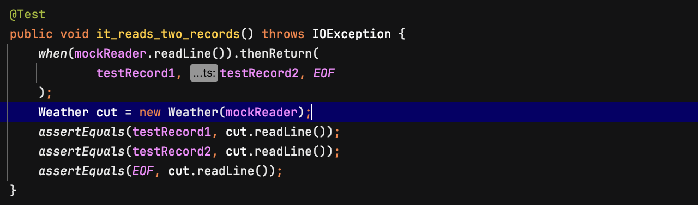 

 

Nothing terribly interesting so far. Let's add in some of the logic we came up with earlier to extract the relevant 
fields from each record. 

We can move the ```TemperatureDifference``` Record from the Sandbox test file to its own source file and give it public visibility.

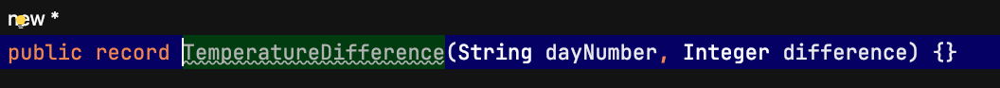

Now we can adjust our test expectations and the return type from ```readline()``` so that we're working with 
```TemperatureDifference``` instances instead of plain Strings. We're still just checking the 
result of method ```readLine()```.

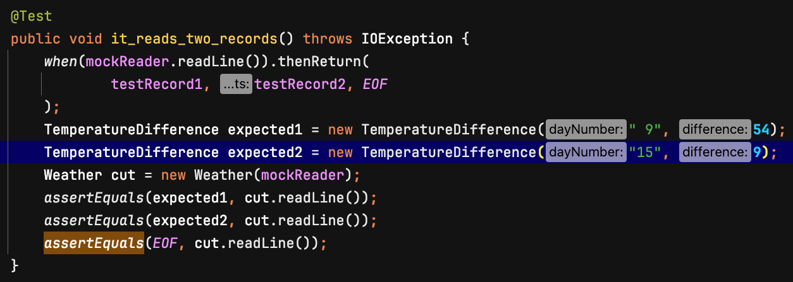

The implementation to return a ```TemperatureDifference``` instead of a ```String``` is taken directly 
from our earlier ```SandboxTest``` example. 

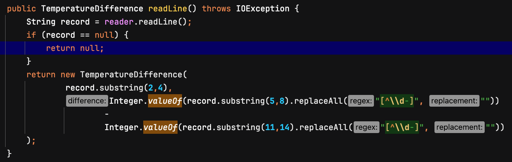


