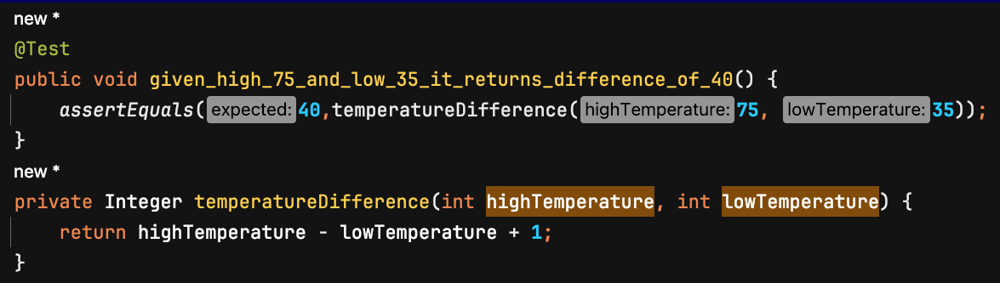

[To README.md](README.md)

# Iteration 2 Java Walkthrough 

In iteration 1 we "cheated" - skipped ahead in the TDD process to get to a point where the difference between mocks and Embedded Stubs would come up. The result was a bit of a mess that didn't really apply the test pattern language in a way that gave us useful information about how it compares with using Test Doubles. This time, we'll painstakingly test-drive the solution. 

We know the solution to the Weather portion of the Kata has to read text records that contain the day number and minimum and maximum temperatures in string form. Then it has to extract the day number and compute the temperature difference per day. Finally, it must return the day number of the day that had the smallest difference between the minimum and maximum temperatures. 

First test: Calculate the difference between two temperatures. The code under test (CUT) is inside the test class because we don't yet have enough examples in place to suggest how we might structure the solution. 

