# Java Exploration 

[Back to README.md](README.md)

## Kata 4, Part 1, Java version using mocks, step 1

By convention, nearly all Java developers separate production and test code by creating separate directory trees for the two, and defining the same package in both trees. Tools like Maven, Gradle, IntelliJ IDEA, and Eclipse IDE assume this is the default directory structure for all Java projects. 

So, making the same assumptions and skipping ahead a bit in the TDD process, the code in subdirectory ```sociabletestsjava``` in package ```com.neopragma.withmocks.v1``` is what I came up with as a starting point for developing Part 1 of the Kata.

Where we are: 

- We have a single failing unit test case that fails for "the right reason". 

- We have a mock of interface ```WeatherData```, which ostensibly will become the basis for a class to read the input file and get the data into a Java-esque form. At the moment, we don't need a concrete implementation class for ```WeatherData```. 

- The Java-esque form of the weather data is represented by a value object, implemented as a Java Record named ```MinMaxTemp```. 


## Kata 4, Part 1, Java version using Nullables, step 1

Now let's bring the Nullables with Sociable Tests version up to an equivalent point. 

Per the pattern language, a Nullable is a class that can be instantiated with a minimal configuration, just suffient to provide a "valid" instance that supports all necessary "business" logic but excludes real functionality to read/write external data stores and so forth. James suggests defining factory methods named create() and createNull() to handle the instantiation. 

His article also provides examples of how to include an Embedded Stub to mimic selected functionality of an external dependency, and how to define parameters for the Nullable's createNull method to pass in values we want to be returned in our test cases. 

Bear in mind I'm not an expert at this; I'm trying it for the first time. Hence, the code in subdirectory ```sociabletestsjava```, package ```com.neopragma.sociabletests``` may be more complicated than necessary. 

Where we are:

- We have a single failing unit test case that fails for "the right reason", not using mocks.  

- We have a Nullable concrete implementation of interface ```WeatherData```, named ```WeatherDataImpl```. It has factory methods ```create()``` and ```createNull()``` based on the explanation and examples from James' article.  

- The Java-esque form of the weather data is represented by a value object, implemented as a Java Record named ```MinMaxTemp```. This is the same as for the version using mocks. 

## Impressions so far 

I found the process of getting the first failing test case to the right state to be far more tedious using Nullables than it was using mocks. 

The main reason was that I had to invest mental energy into the details of handling file I/O. I wanted to focus on the challenge of the Kata, and leave the I/O handling for later. But I had no choice if I wanted to write a Nullable that included an Embedded Stub that could behave exactly like a Java BufferedReader to ingest the input file provided for the Kata. There was no way to make any progress at all without that stub in place.

## Kata 4, Part 1, Java version using mocks, step 2 

The aim of this step is to implement enough functionality to identify the day that has the smallest temperature spread, given more than one day's weather data. 

First, I set up a test case with a mock that returns three values in succession, like this. 


As expected, it failed because the production code always returned the first entry in the list. So far, so good. 


A naive implementation makes the test case pass. 


## Kata 4, Part 1, Java version using Nullables, step 2

Now let's do the same with our Nullables version. 


Here's the output from the test run:


The new test case fails as expected, but not for a "good" reason. Notice the actual result was Day 4, which isn't correct. The production code is plucking out the second digit of the day number from the input record, and the first day in this set of input data is 14. This is because of the hacky implementation of the Embedded Stub. 

This is in the ```loadMinMaxTemps()``` method of class ```WeatherDataImpl```. 


If we change this hack to a slightly different hack, we can extract the strings corresponding to field values in each input record into integers, removing all characters that are not numerical digits. We can also handle day numbers of 1 or 2 digits and temperatures of up to 3 digits (but not negative numbers or decimal places).


Now the new test case fails for the "right reason" - the production code always returns the first day number in the list. 

If we put the same naive solution into the ```Weather``` class as we did in the mock version, the test cases all pass. Now both versions are at the same point.

## Impressions so far

I spent considerably more time taking this small step with the Nullables version than with the version using mocks. I had to context-switch between thinking about the business logic of the application and thinking about how to make the Embedded Stub behave like a mocked-out BufferedReader. This involved some fiddling because the input file format is not typical for Java applications. 

Since I had to make the Embedded Stub work the same as a BufferedReader, I wondered if the program would "just work" with the entire input file. I wrote a driver class, cleverly named ```Driver```, to run the application from a command line. Lo and behold, after a little tweaking of the ```substring()``` values for the fields, the "full application" ran and yielded the correct answer. 

This result would have been deferred using the version with mocks, as I wouldn't have bothered to get the I/O functionality working this early in the development process.

## Kata 4, Part 2, Java version using mocks 

The second part of the Kata asks us to write code roughly similar to the Weather program to analyze statistics from the English Premier Football League. A file is provided containing data about teams that played in the 2001-2002 season. 

Our program is to determine the team with the smallest difference between the number of goals they scored against opponents and the number of goals opponents scored against them.

The input file contains fixed-format records, like the Weather data file, but with different fields.  

The challenge is intentionally similar to the Weather problem in Part 1 of the Kata, because we'll try extracting common code in Part 3 (yes, I read ahead.) It took virtually no time to set up the same kind of unit tests and starter code for this application, which is in subdirectory ```sociabletestsjava``` in package ```com.neopragma.withmocks.v3```. 

## Kata 4, Part 2, Java version using Nullables 

It took much longer to get the Sociable Test version to the same point. The time was spent in fiddling with the details of field positions and lengths in the ```StubbedReader``` class for ```FootballDataImpl```. 

## Kata 4, Part 3, Java version using mocks, refactoring

Part 4 of the Kata asks us to factor out common code from the Weather and Football solutions. Let's see how easy or hard it is to test-drive these changes, starting with the version using mocks. 

These two methods are almost identical. This is ```getDayWithMinimumTemperatureSpread()``` in class ```Weather```. 

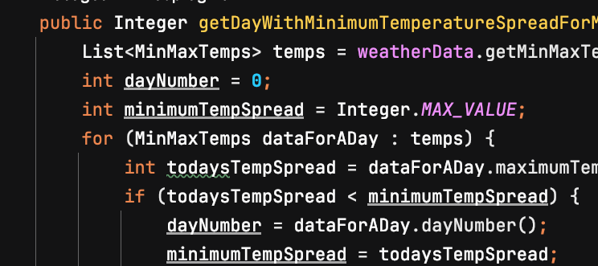

This is method ```getTeamWithMinimumScoringSpread()``` in class ```Football```.

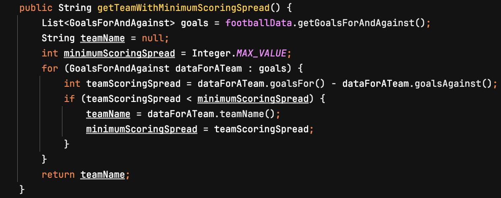

Both these methods look for an entry in a list of value objects that meet certain criteria. In both cases, the entry of interest has the minimum difference between two integers. 

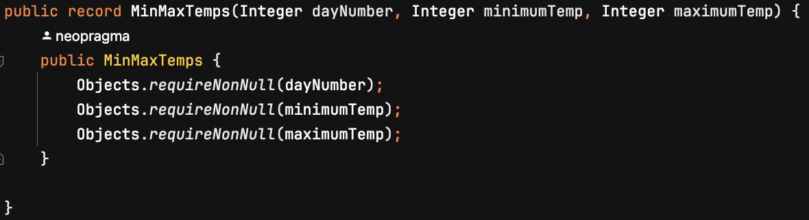

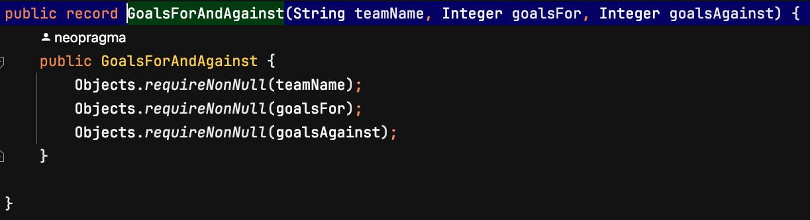

The value objects could be of a generalized common class. Each contains a sort of "key" that identifies either a day or a football team and two integers that represent a range of values. 

The methods to find the value object in a list that has the smallest range of values could be generalized and moved to a helper class. 

The "key" for the Weather solution is the day number when the temperature range was smallest. It's currently an Integer, but there's no reason it couldn't be a String. That would make the types of the values in the data object the same. 

Let's see what changes we must make to the test cases to express the intent of the refactoring. 

In class ```FootballTest```, our test case refers to the value object class ```GoalsForAndAgainst```. We'll want to change those references to the name of our common value object class. Let's call it ```ValueRange```, for lack of a better name. 

That will change this...

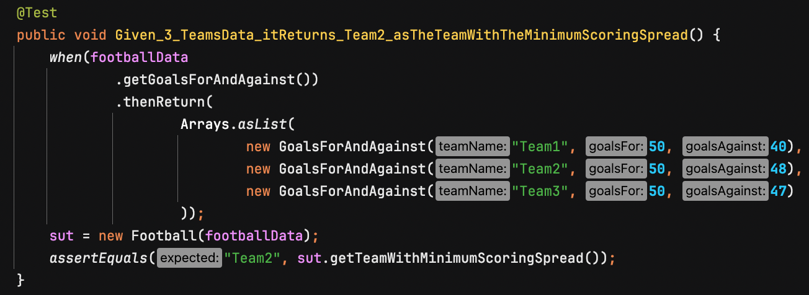 

...to this...

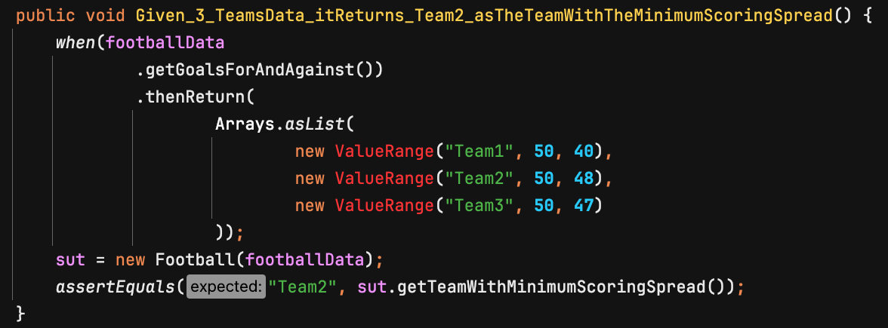

At this point the test class doesn't compile. We need to create the ```ValueRange``` class. 

Why not change the other football-specific references? We want the code to be self-describing. If everything were generalized, people would not be able to see at a glance which code pertains to football and which code pertains to weather. We'll leave the class names and method names for football-related code the same. 

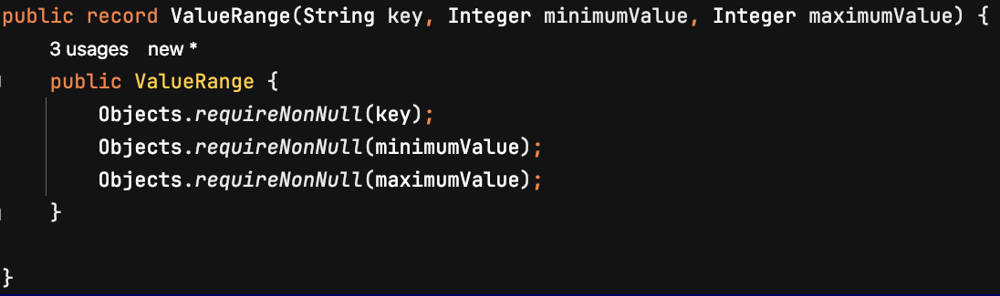

Now in class ```Football```, method ```getTeamWithMinimumScoringSpread()```, let's generalize the names of things so we can extract a common method to find the smallest range for "any" data. 

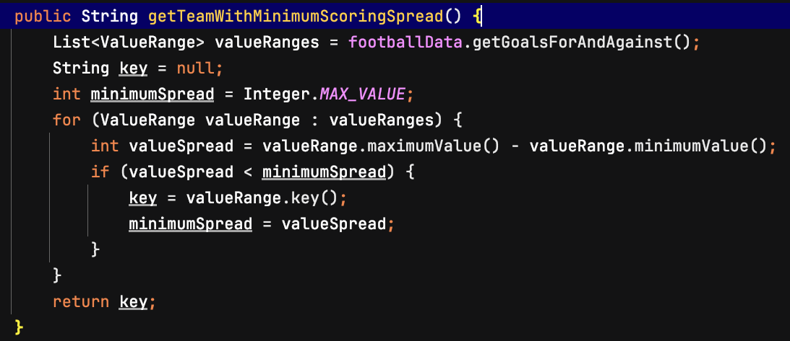

We need to modify the ```FootballData``` interface so it returns a list of ```ValueRange``` objects instead of the old ```GoalsForAndAgainst``` objects. 


With these changes done, running the tests for package ```com.neopragma.withmocks.v4``` got one test failure - the one we changed. It failed for the expected reason. The code under test returned "Team1" instead of "Team2". We set the wrong expectation so we would see that the test case could fail for the right reason. It can. Fixing that, we're all green. 

Now to tackle the Weather side. We start by making similar changes to class ```WeatherTest``` so we're using the common ```ValueRange``` class instead of the Weather-specific ```MinMaxTemps``` class. This time, we have to change the "key" values to Strings instead of Integers, and all references to those values. 

In class ```Weather``` we change method ```getDayWithMinimumTemperatureSpread()``` to create a list of ```ValueRange``` objects instead of ```MinMaxTemps``` objects, and we change the return type to String.

In class ```WeatherData```, method ```getMinMaxTemps()``` needs to return a list of ```ValueRange``` objects. 

Several changes were required, but they were straightforward. 

We can delete classes ```MinMaxTemps``` and ```GoalsForAndAgainst```. One more test run to make sure we didn't inadvertently break something when we deleted them. 

Next, we need to extract the common code for finding the list entry with the smallest spread of values into a separate helper class. 

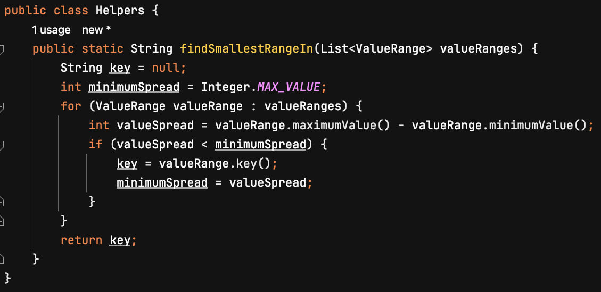

That reduces ```getTeamWithMinimumScoringSpread()``` to just this...

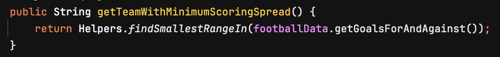

...and ```getDayWithMinimumTemperatureSpread()``` to this:

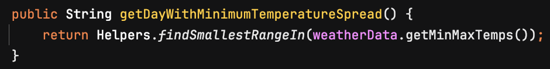

## Kata 4, Part 3, Java version using Nullables, refactoring #1 

This is the same refactoring I did for the mock version, to generalize the ```GoalsForAndAgainst``` and ```MinMaxTemps``` value object classes and extract the code to find the list entry with the smallest range of values to a Helper class. 

Here I experienced an advantage of the Nullables approach. There was no need to modify the test cases to make them refer to ```ValueRange``` objects, because the test code for the Nullables solution passes fake input records as Strings rather than Lists of ```ValueRange``` objects. 


## Kata 4, Part 3, Java version using Nullables, refactoring #2

When copying source from the \*.v2 and \*.v3 packages, the project wouldn't build due to duplicate class names - the Embedded Stub classes in ```WeatherDataImpl``` and ```FootballDataImpl```. This is part of the hand-rolled mock code I wrote to try and follow the guidelines for Nullables. 

I was planning to extract that into a common class anyway, but I wanted to try and get all tests passing with the code as it currently stood in package \*.v2 for Weather and package \*.v3 for Football. Had the code been in the same package from the beginning, this name collision wouldn't have occurred (or would have occurred much sooner). My fault for keeping the code separate for parts 1 and 2 of the Kata.  

The twist is the ```withInputRecords()``` method in both ```StubbedReader``` classes. To mimic the behavior of the "real" BufferedReader, that method adds header lines to the input record array that look like the header lines from the ```weather.dat``` and ```football.dat``` files. 

That part of the code must differ between the Weather and Football solutions; but I'm loathe to start changing that code until I have a clean test run for the existing code. Alternatively, we could shift the burden of supplying the fake header records to test methods, and omit that logic from ```StubbedReader```. That would simplify the extraction, but complicate the test suite and invite errors in test case setup.

The code in ```WeatherDataImpl``` and ```FootballDataImpl``` that uses the ```StubbedReader``` instances will have to pass the appropriate fake header records to those instances. Then, the logic in the ```StubbedReader``` will have to change slightly to handle the fake header records. 

With ```StubbedReader``` now separate from ```WeatherDataImpl``` and ```FootballDataImpl```, I moved the responsibility for inserting the header records to the callers of method ```withInputRecords()```. 

Here's the original ```createNull()``` method in class ```WeatherDataImpl```. 

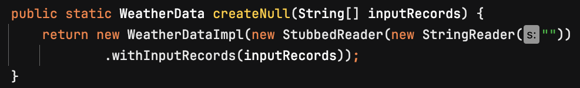

Here's the original ```withInputRecords()``` method in the Embedded Stub class ```StubbedReader``` from class ```WeatherDataImpl```. 

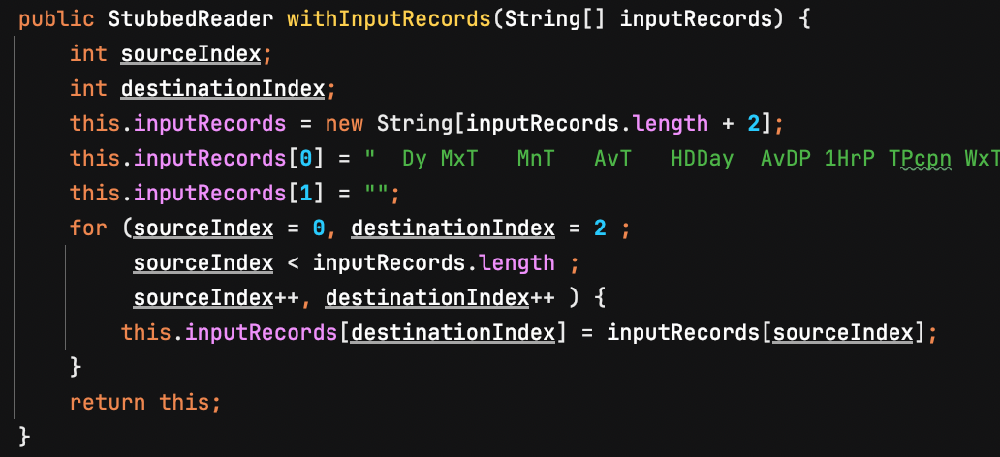

I took the code from ```withInputRecord``` that adds fake header records to the array of fake input records and moved it to the caller, ```WeatherDataImpl.createNull()```. 

The methods then looked like this:

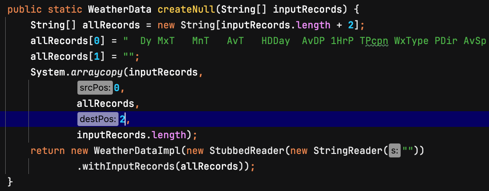

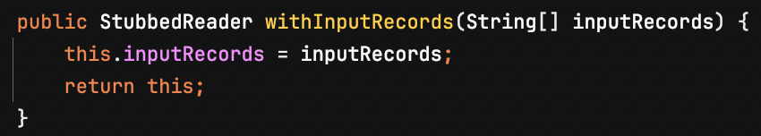

Now let's make similar changes to ```FootballDataImpl```. The original version:

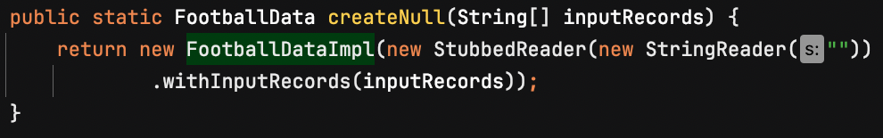

The modified version:

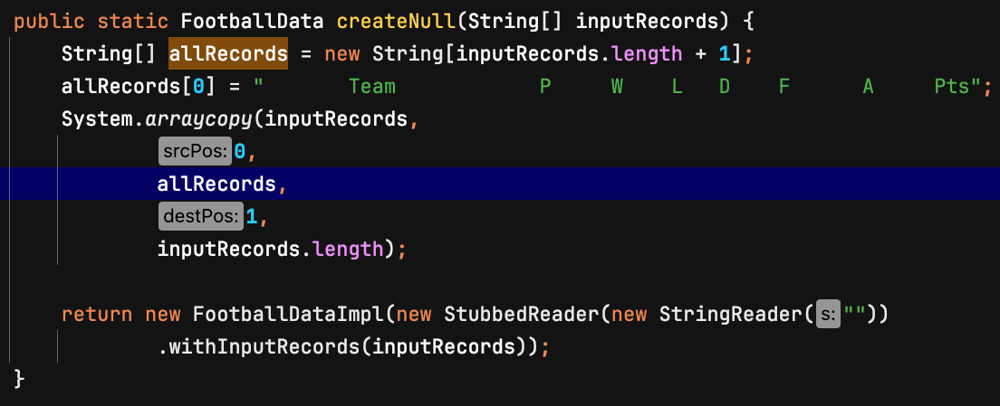

Both ```WeatherDataImpl``` and ```FootballDataImpl``` can use the same ```StubbedReader```.

And that concludes the first refactoring. 


## Kata 4, Part 3, Java version using Nullables, refactoring #3 

Both ```WeatherDataImpl``` and ```FootballDataImpl``` contain the same one-line helper method, ```stringToInteger()```. The method takes a string that may contain a numerical value along with non-numeric characters, removes all the non-numeric characters and returns an Integer. We could move this to the ```Helpers``` class we created earlier.

It's only a one-liner, but it is used in more than one place and it contains a Regular Expression. If multiple copies of it exist in the codebase, the Regular Expression may be modified unintentionally and the results could be confusing. So, let's move it. 

No changes to test code are necessary.

This refactoring was quite simple to test-drive. I'm still not convinced this code should exist at all, however.

## Observations up to this point

#### Developer experience

Working with Java, Maven, Mockito, and IntelliJ together isn't exactly a dream weekend at [Barbie's beach house](https://www.vogue.com/article/barbie-dreamhouse-airbnb-malibu). A development approach that eliminates one type of dependency - in this case, the mocking library - sounds like an instant improvement.

Yet I found working with the Nullables version was more tedious and time-consuming than working with the mock version. To my surprise, I soon felt eager to go back to struggling with Mockito/IntelliJ integration. On balance, it was less troublesome than using Nullables.

I also didn't like the frequent context-switching between hand-rolling the Embedded Stub and working on the actual problem at hand. There was no way to write test cases without the stub. I wanted to focus on the application logic at first, and mocks enable that.

**After May 1** 

With the benefit of James' feedback and continued practice, I started to get a better sense of the Nullables pattern. Originally, I had brought a mock-oriented mindset to the work, and that caused some friction. As I started to adjust my thinking, I found the developer experience easier than I did at first. 

#### Recruiting and staff retention

The vast majority of Java developers available for hire are already familiar with mock libraries. Every organization that uses Nullables will have their own "flavor" of it, as it's all hand-written. That means surprises, and lots of them, in the sense of the [Principle of Least Surprise](http://principles-wiki.net/principles:principle_of_least_surprise). It's not out of the question to expect an organization that required this approach to face higher turnover of technical staff than they would otherwise. 

**After May 1** 

I still think this is a factor to consider. The pattern language is not a standard "thing" that is supported by a well-known library "everyone" uses. Maybe someday it will be.

#### Codebase size

The Nullables solution for Kata 4 ended up with thirteen (13) production classes as compared with six (6) for the version using mocks. 

Granted, I didn't finish the whole thing using mocks, and there would be eight (8) classes in a version equivalent to the Nullables version. Even so, the exercise suggests there's more code to manage with the Nullables approach.

**After May 1** 

There were two separate issues initially. First, my own understanding of the Nullables pattern was incorrect. I wrote more code than necessary to implement most of the ideas in the model. The second issue looks like a language-specific problem. It takes more code to implement an infrastructure wrapper with an Embedded Stub in Java than it does in JavaScript. 

#### Unused code in production 

**After May 1**

I initially noted this concern under General Observations, but after applying James' suggestions to bring the Java solution into better alignment with the Nullable patters, I learned that Java requires a lot more code than JavaScript to implement an infrastructure wrapper with an Embedded Stub. So I'm moving this concern here, to the Java-specific section of the notes. 

#### Impact on throughput

The most complicated logic is in the ```StubbedReader``` class, which is to all intents and purposes just a hand-rolled mock or stub. Most of the development time went into that class, as well. It's still a hack, and would require modification to correspond with every future change to the product. I suspect this is characteristic of the approach. A codebase containing hundreds or even thousands of these things would cause teams to burn a lot of time working on code that isn't really part of the product.

The exploration suggests a "real" team that worked in this way would spend proportionally more time on test setup code than they normally would do. That means less time spent on value-add activities, lower process cycle efficiency, and lower throughput.

**After May 1** 

While my initial implementation of ```StubbedReader``` deviated from the pattern in that it was in a separate class, when I adjusted the structure of the code to align with the Nullable pattern the complexity moved into the infrastructure wrapper class, ```FileSystem```. The complexity is still there. As noted elsewhere, this appears to be due to the way Java works. 

## Continuing development of the Java solution 

Let's get the Java implementation in shape before moving on to other languages. There's no need to repeat the noob mistakes over and over.

There are common mistakes that people who have a background using mocks make when they start using this technique. It seems I made them all. So, let's examine the mistakes. 

We thought it would be useful to keep the previous results in place and refactor the Java solution to align more closely with James' approach. That way, you can see how an experienced developer can make these mistakes, and that it's all part of the learning curve. We all struggle with new things, and that's normal.

In addition, if you work in a place that has started to adopt this technique, the already-existing codebase may have been built using mocks, and the same general kinds of issues may exist. Showing the mistakes followed by gradual corrections may be useful. 

We can also avoid repeating the same mistakes with other programming languages as we continue to explore Nullables and Sociable Tests. 

## Correction 1: Remove interfaces 

Let's start with the low-hanging fruit.

JS May 1: "You don't need interfaces. Your code doesn't have multiple implementations of the interface, so they're redundant. WeatherData and WeatherDataImpl can be combined into WeatherData. Ditto for FootballData."

I defined those interfaces as the basis for mocks, and then mindlessly carried over the same design to the Nullables version of the code. I agree with James' observation. We can reduce the number of classes in the solution by two quite easily. 

These changes are in package ```com.neopragma.sociable.v5```.

I started by using the Safe Delete feature of IntelliJ to remove interface FootballData. The IDE flagged five places in the code where deleting the interface might be unsafe:

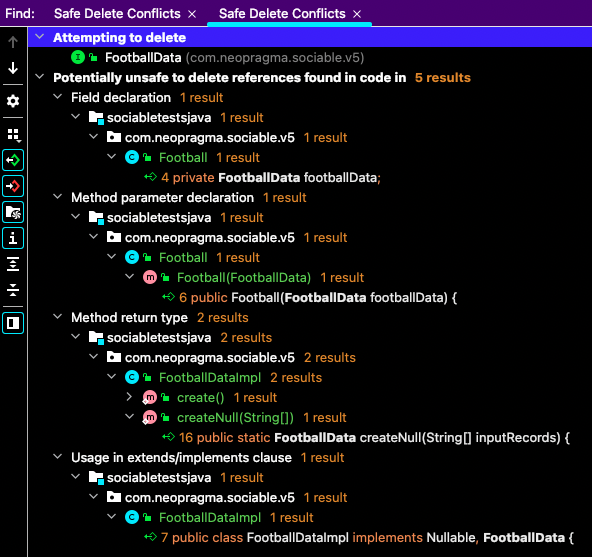

The ```Football``` class has a reference to the name ```FootballData```. That's fine, as I plan to rename ```FootballDataImpl``` to ```FootballData``` in a minute. 

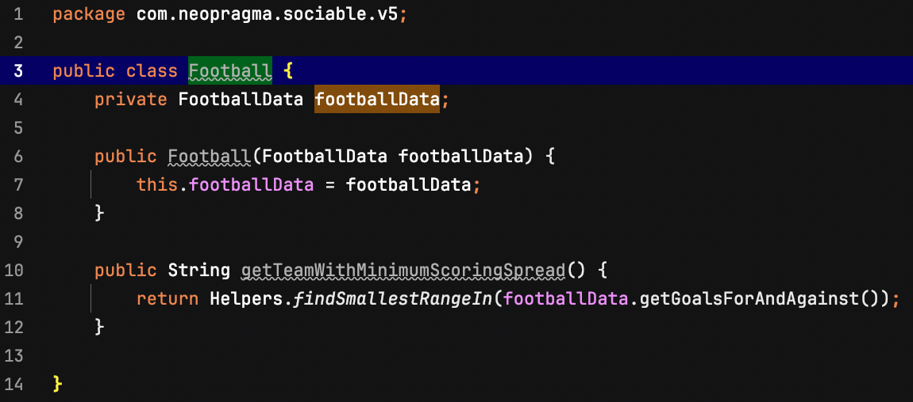

```FootballDataImpl``` implements interface ```FootballData```. I'll remove that reference and rename this class, so this one won't be a problem. 

No need to repeat all the warnings here - they're references to the name ```FootballData```, which will all be fine once I rename class ```FootballDataImpl```. There's also an ```@Override``` annotation to remove in that class. 

All tests passed. 

Next I repeated the same process for ```WeatherDataImpl``` and ```WeatherData```. 

All tests passed. 

## Correction 2: Simplify class structure 

JS May 1: "...Weather/Football doesn't have any meaningful code. They're both answering a question about the underlying Weather file. Why not answer that question directly in WeatherData..." 

My last set of refactorings reduced ```Weather``` and ```Football``` almost to nothing. This suggestion really amounts to continuing the refactorings I had started until their logical conclusion. 

Moving this method from ```Weather``` to ```WeatherData``` enables us to eliminate class ```Weather```. 

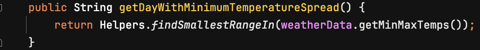

We also needed to change references in ```Driver``` to ```WeatherData``` instead of ```Weather```. This simplified the code in ```Driver```. 

All tests passed.

Now we have a one-line method that calls another method in the same class, and isn't used anywhere else. We can simplify that.

Before:

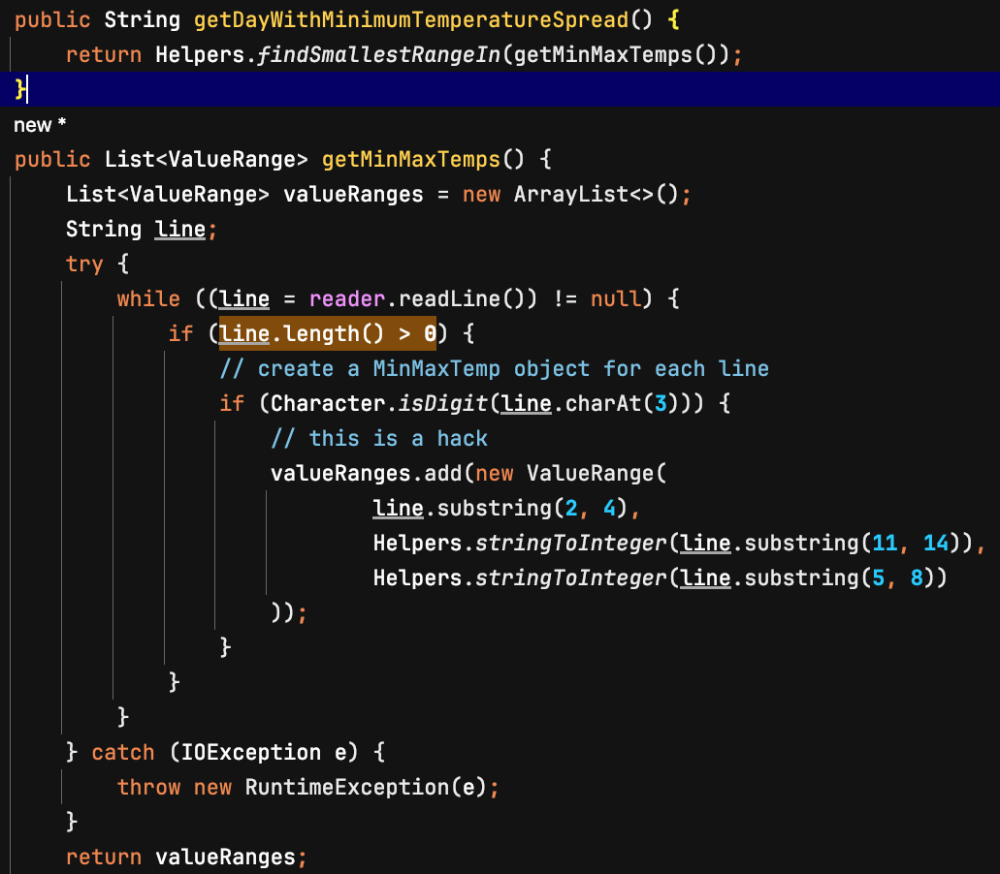

After:

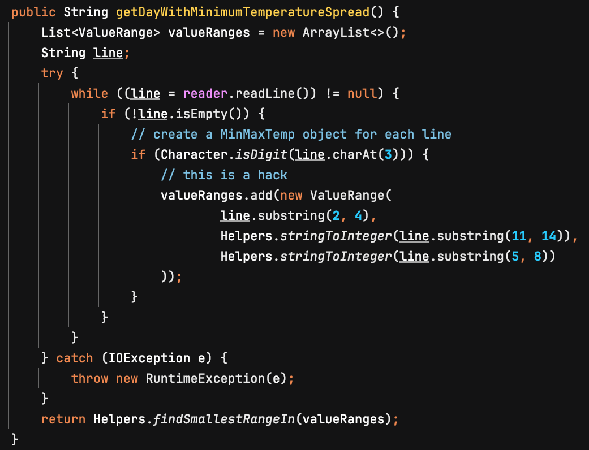

All tests passed. 

Now we want to do the same thing on the Football side. 

All tests passed. 


## Correction 3: Improve names 

JS May 1: "And as long as you're combining Weather and WeatherData, why not call it what it is? It's an abstraction over the ```weather.dat``` file. I would call it ```WeatherFile```. 

There were additional suggestions related to renaming this class ```WeatherFile```, which we'll get to in a moment, step by step. For now, we'll just rename it. 

All tests passed.

The same for Football again.

All tests passed. 


## Correction 4: Create infrastructure wrapper class

JS May 1: "In the Nullables patterns, WeatherDataImpl and FootballDataImpl are 'high level infrastructure wrappers.' They should delegate to a 'low level infrastructure wrapper' that talks to the external system. In this case, I would have them delegate to something that abstracted the file system. Because I like stupid-obvious names, I would call it 'FileSystem.' It can expose the only thing you care about, which is 'String readFileContents(filename).'"

Another advantage of using an infrastructure wrapper is that the "business" logic doesn't need to deal with I/O exceptions. 

I think the current way to read the full content of a text file into a String in Java is ```Files.readString()```. The available facilities change a bit from release to release of Java. 

But that isn't what I need here. I need to process each record individually to pluck out the substrings that correspond to logical "fields" in the record, and deal with leading spaces in the numerical values. 

What we're given for the Kata is sort of a mix of mainframe-style file formats and \*nix-style file formats. Fields begin at a given offset from the beginning of each record and they have a fixed length (mainframe-style), but records are variable-length and terminated with a newline character (\*nix-style). So we have to muck with the data, whether by scanning through a giant String and looking for the newlines, or by processing one record at a time and plucking out the fields. 

This is a detail pertaining to the format of the data, and nothing to do with adjusting the structure of the code to fit the Nullables pattern. 

Let's start with the Weather code. 

In method ```getDayWithMinimumTemperatureSpread()```, we read the input file and convert the data into a form that's easier to process than the raw records. We're getting each record from a ```BufferedReader``` instance - either a real one or a stubbed one. We can get the records from our new ```FileSystem``` wrapper instead. The rest of the logic can remain as it is. 

As they currently stand, the ```create()``` and ```createNull()``` methods of ```WeatherFile``` look like this.

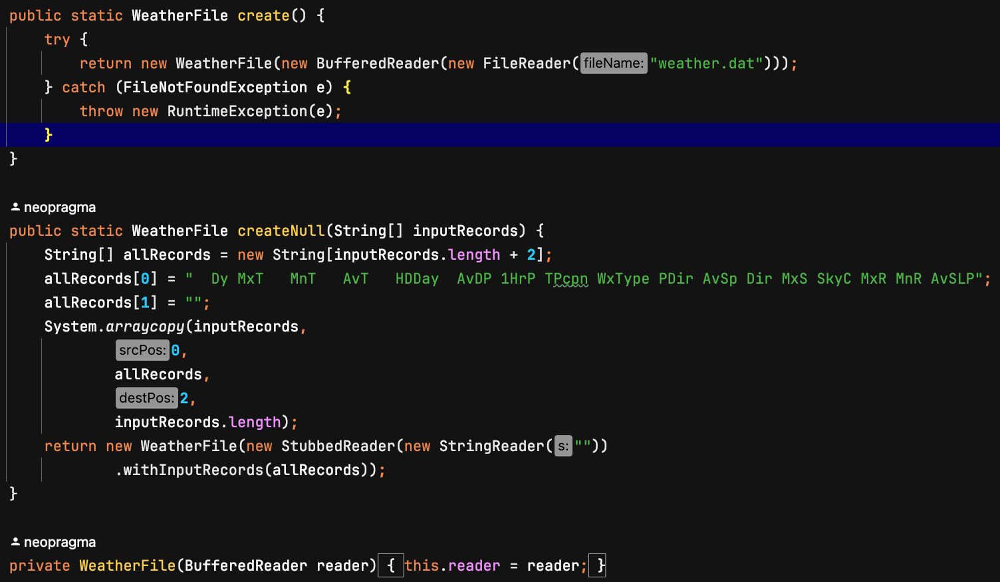

Using the "die roller" example [from James' article](https://jamesshore.com/v2/projects/nullables/testing-without-mocks#nullables) as a guide, I created an infrastructure wrapper class named ```FileSystem```. You can find the source under subdirectory ```sociabletestsjava``` in package ```com.neopragma.sociable.v5```.

This is where the promise of "less code" fell apart. I attribute it to differences between JavaScript and Java. In Java, this requires considerably more code than in JavaScript. It also causes a fair amount of unused code to be deployed with the production application, and still has the potential risks of expanding the threat surface of the application. 

I modified the ```WeatherFile``` class to work with the new ```FileSystem``` class. The new version of that class is also in package ```com.neopragma.sociable.v5```. 

All tests passed. 

Next I did the same for the ```FootballFile``` class. 

All tests passed. 


## Correction 5: Make the Driver class testable 

JS May 1: "A full implementation would have a nullable StdOut and System exit, which would allow you to test Driver, but we'll let that slide."


